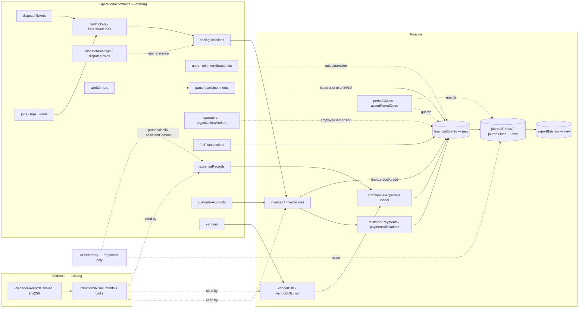

# LeaseOS Finance & Accounting Control Center — F0 survey and design

**Status**: design only. No production code, migration or test was changed to write it.
**Measured at**: `main` = `0060690` (2026-09-23), plus every open remote branch.
**Stops here by design**: section 5's first slice is proposed, not built. It needs an owner's approval,
and so does the moratorium question in §2 (G15), before any code lands.

The request was to design a Finance domain that serves three operating models: LeaseOS as a
subledger feeding QuickBooks or similar, LeaseOS as the operational workspace with an outside
accountant, and a future LeaseOS-native ledger. **The main survey finding changes the premise.**
LeaseOS already has a substantial finance backend: 184 money procedures across 14 routers.
It has no journal, no export ledger and no general inventory. And **72 of its money procedures (in 10
routers) do not check which organization the caller belongs to.** The first slice therefore has to close that
hole before anything new is built.

---

## 1. Repository finance survey

### 1.1 Migrations and branches

| Fact | Evidence |
|---|---|
| `main` ends at `0168_retire_storage_capability_urls.sql` | `ls drizzle/*.sql` |
| `main` already carries a duplicate number: two `0157_*` files | `0157_seal_verification_unavailable.sql`, `0157_signature_device_attestation.sql` |
| Slots `0016`/`0017` are reserved and gate 0 refuses them | `scripts/ci-gate.sh` |
| `0169_defect_resolution` is claimed by PR #4 and by #5, #6 and #9 via their bases | `readiness-defect-repair` and dependents |
| `0170_dispatch_role_types` and `0171_dispatch_role_assignment_events` are claimed by PR #9 | `feature/dispatch-role-assignment-backend` |
| **`0170_organization_scoped_role_grants` is also claimed**, by the unmerged branch `claude/leaseos-auth-workspace-system-t008ad` | **This is an existing collision with PR #9, unrelated to finance** |
| The migrations are applied in two ways: the gate runs `scripts/apply-migrations.sh` over every file in `ls` order; production runs `scripts/migrate.ts`, a checksummed ledger that refuses on drift | `server/_core/migrationLedger.ts` |

Consequence: renaming a migration file is safe **before** it has been applied anywhere, and forbidden
after (it becomes DRIFT). Finance must not pick a number until its migration PR is ready to merge (§10).

### 1.2 Conventions finance must follow

| Concern | Convention on `main` | Where |
|---|---|---|
| **Money** | Integer minor units: `int …Cents`, `bigint …Cents {mode:"number"}` for approval amounts. Rates and quantities are integer thousandths (`…Millis`), margins are `…Bps`. No `decimal` money column exists. A test gate refuses any new `double` money column; 30 legacy doubles are grandfathered with trigger-maintained int shadows. | `server/_core/money.ts` (`toCents`, `fromCents`, `toMillis`, `reconcile`), `LEASEOS_B22_3_MONEY_PRECISION.md`, `server/zzMoneyPrecision.test.ts` |
| **IDs** | `int` autoincrement PKs; business keys are unique `…Ref`/`…Number` varchars; numbered documents come from `nextTrackingNumber` (INV, BB, CR) | `server/_core/trackingNumbers.ts` |
| **Time** | `timestamp` → JS `Date`, computed in UTC; accounting period is `varchar(7)` `YYYY-MM` | `periodRouter.ts:9`, `periodCloseService.ts` |
| **Tenant for money** | `financialEntities.orgRef` (0146) is "the tenant boundary for money". One organization owns many entities (books). NULL means the historical single tenant. | `server/_core/entityScope.ts` |
| **Tenant resolution** | `resolveActingScope(db, userId)` gets the tenant from the membership, **never from input**. An ambiguous membership is refused. Out-of-scope rows answer NOT_FOUND. | `server/_core/actingScope.ts:65` |
| **Authorization** | `roleProcedure("<name>")` maps to a permission in `recordsAuthorization.ts`, with GRANTS, DENIALS, SENSITIVE (fail closed if the audit row fails), and bare `protectedProcedure` pinned at 0 | `server/_core/trpc.ts`, gate 5 |
| **Finance roles** | `bookkeeper`, `payroll_admin`, `tax_preparer`, `controller`, `external_accountant`, `auditor`, plus operational roles. AP and AR are permission families, not roles. | `recordsAuthorization.ts:26,349` |
| **Approval engine** | `commercialApprovalPolicies`: per book, per category, with amount bands, approver role, second person and separation of duties. It feeds the `commercialApprovals` and `commercialApprovalSignatures` ledgers. The single entry point is `decide()`. | `server/_core/commercialApprovalService.ts:27`; 0133 and 0136 |
| **In-transaction events** | `emitDomainEvent(tx, …)` writes `domainEventOutbox` in the caller's transaction (actorSource human/system/ai/integration) | `server/_core/eventEmitter.ts:115` |
| **Authorization audit** | `authorizationDecisions` is written **before** the handler, outside its transaction, and has no previous/new status | `server/db.ts:1384` |
| **Documents** | `commercialDocuments` (contentHash `char(64)`, versioned, supersedes) + `commercialDocumentLinks` (recordType/recordRef) over `evidenceRecords` (sealed, sha256, versions) and `storage.ts` keys | 0144, `LEASEOS_B20_RECORDS_VAULT.md` |
| **Offline** | Client `Outbox` → `SyncEngine`; idempotent upload by `clientCaptureRef = deviceRef:localId` (UNIQUE on `evidenceRecords`); signed packages; nonce replay guard; `syncConflicts` keeps both versions | `client/src/runtime/outbox.ts`, `server/deviceRouter.ts:162` |
| **AI boundary** | Proposals carry field-level source, confidence and status. The only path to a record is `executeAssistantCommit` after read-back, with 5 allowed target types (it includes `expense_record` and `fuel_transaction`). The `actionGateway` has a `NEVER_AUTONOMOUS` list. | `assistantCommitService.ts:114`, `actionGateway.ts:60` |
| **Tests** | `*.db.test.ts` guarded by `DATABASE_URL`; raw-SQL `org()`/`member()` seeds; `appRouter.createCaller`; cross-tenant exemplar `server/tenantScopeMoney.db.test.ts` | `vitest.config.ts` (`fileParallelism: false`) |
| **Gate** | `DATABASE_URL=… bash scripts/ci-gate.sh`: reserved slots, clean DB, migrations, table parity, `tsc` (including the tests project pinned at 0 errors), bare-procedure count, vitest (no skipped `.db.test.ts`), build, external/integration pins, generated `LEASEOS_CURRENT_STATE.md` | CI runs it on MariaDB 10.11 |

### 1.3 Finance that already exists (reuse, do not duplicate)

| Domain | Tables | Router (procedures) | Scoped to caller's org? |
|---|---|---|---|
| Books and entities | `financialEntities`, `taxRegistrations` | `finance` | **yes** |
| Payroll and contractors | `payRuns`, `payRunLines`, `payrollAdjustments`, `contractorSettlements` … | `payroll`, `contractors` (40) | **yes** |
| Commercial office | `commercialSettings`, `commercialApprovalPolicies`/`Approvals`/`Signatures`, `commercialGlAccounts`, `commercialGlMappings`, `commercialDocuments` | `commercialOffice` (43) | **yes** (`bookOrgRef`) |
| Pricing | `chargeDefinitions`, `pricingDecisions`, `customerContractTerms`, `commercialSetupProfiles` | `commercialSetup` | **yes** |
| **AR invoicing** | `invoices`, `invoiceLines` (cites `fieldTicketLineId` + `pricingDecisionRef`), `billingSnapshots` (hashed), `billingBooks`/`Entries`, `disputeCases` | `invoicing` (7) | **no** |
| **AR cash** | `customerPayments`, `paymentAllocations` (transactional, `FOR UPDATE`, never over-allocates), `customerCredits`, `writeOffRequests`, `collectionEvents`, `customerAccounts` | `ar`, `bank` (11) | **no** |
| **Period close** | `periodCloses` (action log: soft_close / close / reopen); `assertPeriodOpen` | `period` (3) | **no** |
| **GST/HST** | `gstReturns` (supersedes), `gstAdjustments`; rates are UNKNOWN until verified | `gst` (5) | **no** |
| **AP** | `vendors` (`bookOrgRef`), `vendorBills` (UNIQUE vendor + invoice number, `accountingPeriod`), `vendorBillLines`, `purchaseAuthorizations`, `spendingLimits`, `roadsideServiceEvents` | `purchasing`, `vendor`, `roadside`, `recovery` (9) | **no** |
| **Capital assets** | `capitalAssets` (`pending_capital_review` … `expensed`), `ccaSchedules`, `ccaClassBalances` | `asset` (10) | **no** |
| **Fuel** | `fuelTransactions`, `fuelAccounts`, `fleetFuelCards`, `bulkFuel*`, `fuelStatements` | `fuel` (7) | **no** |
| **IFTA** | `jurisdictionDistanceRecords`, `iftaReturns` | `ifta` (7) | **no** |
| Expenses | `expenseRecords` (draft → posted; doubles + cents shadows), `expenseAllocations`, `expenseCategories` | `finance.expense*` | yes |
| Shop inventory | `parts`, `partMovements` (signed ledger: receive, issue, return, adjust, transfer, scrap …; `workOrderId`, `vendorBillLineId`, `unitCostCents`) | `shop` (`partIssue`, `stock`, `workOrderCost`, `unitCost`) | **no, deliberately unscoped** (`tenantScopeShop.db.test.ts:5`) |
| Projects | `quotes`, `changeOrders`, `projectBudgets` (by `jobId`), `budgetLines` | `project` | via job |
| Audit packages | `auditPackages` (kinds include tax, vendor), items, access | `audit` (6) | **no** |
| Customer terms, POs, rate cards | `customerAccounts` terms, `customerPurchaseOrders`, `customerRateCards` | `commercial` (7) | **no** |

**What does not exist**: journal entries, debit/credit lines, a trial balance, posting, export batches,
an accounting connector (`commercialSettings.accountingTarget` defaults to `quickbooks_online` and
nothing reads it), AP payments as records (a bill just becomes `paid`), purchase-order lines, goods
receipts, general stock (PPE, office, safety), stock locations and bins, tables for branch,
department or cost centre (`costCenter` is free text on `billingBooks`/`fieldTickets`), a "Driver
Wallet" data model, and any DB trigger that protects a finance row.

### 1.4 Operational records finance cites (canonical sources)

| Concept | Canonical record | Notes |
|---|---|---|
| Customer | `customerAccounts` (`financialEntityId`) | `jobs.customer` is free text; a consultant is `externalIdentities` + `signatoryAuthorities` |
| Billable charge | `fieldTicketLines` + `pricingDecisions` | Ticket lines carry facts, never money |
| Job, trip, load | `jobs` (`orgRef`), `trips`, `loads` | loads are scoped through the job |
| Dispatch | `dispatchPostings`, `dispatchRoles` (`postedRateCents`) | PR #9 adds `dispatchRoleAssignmentEvents` |
| Disposal ticket | `disposalTickets` (only `verified` counts toward billing), `facilityStatements` | |
| Unit / trailer | `units` (via `coreRecordOwnership`); trailers are `units` rows; `capitalAssets.unitId`/`trailerId` | no `trailers` table |
| Odometer / engine hours | `telemetrySnapshots`, `workOrders`, `trips`, `fuelTransactions` | `odometerReconciliation` in `_core/telematics.ts` |
| Employee | `operators`, `organizationWorkers`, `employeePayrollProfiles` | |
| Work order | `workOrders` (`laborMinutes`), `partMovements.workOrderId` | |
| Lease / well / site | `locationIdentities` (text: lsd, uwi, lease), `billingBooks.afeNumber` | no rig or project table |
| Document | `commercialDocuments` → `evidenceRecords` | |

---

## 2. Contradictions and gaps found

Severity: **S** = security or integrity defect on `main` today; **D** = design gap; **O** = needs an owner decision.

| # | Sev | Finding | Evidence |
|---|---|---|---|
| **G1** | **S** | **72 money procedures take a `financialEntityId` or a document reference and never check it against the caller's organization.** A bookkeeper in Org B can read Org A's AR aging, close or reopen Org A's period, void Org A's invoice (with the grant), release payment on Org A's bill, and finalize Org A's GST return. Also: `audit.packagePrepare` assembles a tax, customer or vendor package for **any** subject reference (cross-tenant export), and `commercial.termsSet` changes any customer's credit limit or hold. | `grep -c` of scope helpers = 0 in `cashRouter`, `periodRouter`, `gstRouter`, `purchasingRouter`, `invoicingRouter`, `assetRouter`, `fuelOpsRouter`, `iftaRouter`, `commercialRouter`, `auditRouter` (11+3+5+9+7+10+7+7+7+6) |
| **G2** | **S** | The approval ladder reads the approver's roles **without `revokedAt IS NULL`**, so a revoked controller still signs. It also finds the ledger row by `(subjectType, subjectRef)` with no book filter. | `commercialApprovalService.ts:29,33` |
| **G3** | **S** | `invoicing.void` mutates in place with no `assertPeriodOpen`, and `invoices` has no accounting date, so voiding rewrites a closed period. (Also flagged by the build-order audit.) | `invoicingRouter.ts:80` |
| G4 | D | There are four tenancy columns for money: `financialEntityId`, `bookOrgRef`, `orgRef` and `tenantId`. Invoices key to the entity; commercial office keys to `bookOrgRef`. | 0146, 0149, `PORTAL_ORG_SCOPE_DEFERRED.md:74` |
| G5 | D | There is no journal, double-entry or export ledger. `gl.exportReadiness` always answers `exported: false`. | `commercialOfficeRouter.ts:520` |
| G6 | D | No DB guard protects posted finance rows. Immutability is application convention only (status checks, snapshots, void columns). | `grep TRIGGER drizzle/*.sql` |
| G7 | D | No request idempotency key exists on any finance mutation. Most finance writes are sequential and non-transactional (`paymentAllocate` is the exception). `billingSnapshots.invoiceId` is not unique. | 0011:58 |
| G8 | D | No finance audit trail captures previous/new status in the same transaction. `authorizationDecisions` is written pre-handler; `periodCloses` and `collectionEvents` are per-domain logs. | §1.2 |
| G9 | D | The only stock is shop `parts`, **with no org scope**. It has no locations, bins, committed quantity, reorder point, or non-shop stock. | `tenantScopeShop.db.test.ts:5` |
| G10 | D | Branch exists only as strings (`organizationMemberships.branchId`, `userRoleAssignments.scopeRef`). Department and cost centre do not exist. | §1.3 |
| G11 | D | There is no "Driver Wallet" record. Receipts are split across `expenseRecords`, `fuelTransactions` and `complianceDocuments`, which the UI calls a "document wallet". | `FleetWorkspace.tsx:348` |
| G12 | D | `customerPayments.status = 'reversed'` is in the enum, but nothing writes it. There are no refunds and no AP payment records. | `cashRouter.ts` |
| G13 | **O** | **P6.7**: purchase orders read `spendingLimits`, while the `purchase_order` tiers in the approval ladder are dead configuration. | `docs/P6_6_P6_7_DECISION_BRIEF.md` |
| G14 | **O** | Migration `0170` is claimed twice by unmerged branches (auth-workspace and PR #9), and `main` already has two `0157` files. | §1.1 |
| G15 | **O** | **SPINE moratorium**: "no new engines until this path is wired". Permitted work is "a deletion, a resolver, or a router over something already written" (quoted on the secretary branch from `SPINE_WIRING_PLAN.md`, which is not in this repo). Every new finance table from F2 on (journals, exports, inventory) is a new engine and needs an owner ruling. | `docs/register/PORTAL_ORG_SCOPE_DEFERRED.md:80` |
| G16 | D | 30 legacy `double` money columns remain, including `expenseRecords` and `expenseAllocations`. Finance must read only the `…Cents` shadows. | `zzMoneyPrecision.test.ts:16` |
| G17 | D | `agentActions.idempotencyKey` is documented as unique, but only a plain INDEX exists. | 0100:16 vs 0100:90 |
| G18 | note | The request asks for a "safe decimal" money type. The repository's safe convention is integer minor units, and this design keeps it. Adding `decimal` would create a second convention. | B22.3 |
| G19 | note | The requested branch name `feature/finance-accounting-core` is superseded by this session's assigned branch, `claude/finance-accounting-survey-2mp4h6`. | — |

**G1–G3 are defects in code that exists today**, not missing features. Any finance UI built before they
are fixed would put the cross-tenant hole on screen.

---

## 3. Proposed finance bounded context

```
                ┌───────────────────────── FINANCE CONTEXT ──────────────────────────┐
                │                                                                     │
 operational    │  Layer 1  SOURCE DOCUMENTS (exist)                                 │
 contexts       │    invoices · customerPayments · customerCredits · vendorBills     │
 emit facts ───►│    expenseRecords · fuelTransactions · partMovements · payRuns     │
 (never money   │    capitalAssets · gstReturns · purchaseAuthorizations             │
  decisions)    │           │ approved/finalized transitions only                     │
                │           ▼                                                         │
                │  Layer 2  FINANCIAL EVENTS (new, append-only, idempotent)           │
                │    one row per consequential money transition, citing its source    │
                │           │ deterministic translator (no AI)                        │
                │           ▼                                                         │
                │  Layer 3  JOURNAL (new; balanced, period-locked, reversal-only)     │
                │    journalEntries · journalLines → commercialGlAccounts             │
                │           │                                                         │
                │           ▼                                                         │
                │  Layer 4  CONNECTORS (new) — export batches, external ids           │
                │    generic CSV/JSON ▸ QuickBooks ▸ Sage/Xero … behind one interface │
                │                                                                     │
                │  Cross-cutting: moneyScope fence · approval ladder · period lock ·  │
                │  domainEventOutbox audit · commercialDocuments evidence             │
                └─────────────────────────────────────────────────────────────────────┘
```

**How the three operating models share one architecture.** Layers 1–2 are identical for every
customer. Operating model 1 (subledger to QuickBooks) exports Layer 2 events, or Layer 3 journals, through a
connector. Model 2 (operational workspace with an outside accountant) exports the accountant
package from Layers 1–3 and gives the accountant the `external_accountant` role. Model 3 (native
ledger) reads Layer 3 as the book of record. The model is a per-book setting, `financeOperatingModel`,
stored next to `commercialSettings.accountingTarget`. The setting changes where data goes, never
what gets recorded.

**Rules of the context**

1. Operational users never see debits and credits. A driver saves a receipt; a dispatcher closes a ticket.
2. Only a server-side, human-authorized transition to `approved`, `finalized`, `posted` or `paid`
   emits a financial event. Drafts, including offline drafts, never do.
3. The Layer 2 → Layer 3 translation is deterministic code. It refuses to post an unbalanced entry
   and refuses to post into a closed period. AI never calls it (§8 and §9).
4. Corrections append: a credit, a reversal event with a reversing journal, or a superseding
   document. They never UPDATE a posted row.

---

## 4. Integration diagram



---

## 5. Exact first vertical slice: **F1 — Money tenant fence**

**Why this slice and not an invoice-to-payment slice.** Every refusal test the request lists ("Org A
cannot see Org B's invoices, bills, expenses; cannot approve Org B's purchases; cannot export Org B's
records") **fails on `main` today** for invoices, bills, payments, periods, GST, assets, fuel,
IFTA, customer terms and audit-package export. Anything built on those routers inherits the hole. This slice:

- needs **no migration**, so it cannot collide with 0169–0171;
- adds no new engine, so it is permitted under the SPINE moratorium (a resolver plus routers over existing code);
- is item 3 on the owner's own roadmap ("prove tenant isolation", `ROADMAP_2026-09-21.md`);
- is the precondition for the build-order's Phase 4 (Office/Finance UI).

**Scope**

1. **Resolvers**, added to `server/_core/entityScope.ts`, following its existing `assert…InScope` style:
   `assertInvoiceInScope(invoiceNumber)`, `assertVendorBillInScope(billRef)`, `assertCustomerPaymentInScope(paymentRef)`,
   `assertCreditInScope(creditRef)`, `assertWriteOffInScope(ref)`, `assertBankAccountInScope(ref)`,
   `assertGstReturnInScope(ref)`, `assertAssetInScope(ref)`, `assertFuelTankInScope(ref)`,
   `assertIftaReturnInScope(ref)`, `assertDisputeCaseInScope(caseNumber)`, `assertPurchaseAuthorizationInScope(ref)`,
   `assertCustomerAccountInScope(accountRef)`, `assertAuditPackageInScope(packageRef)`. For `audit.packagePrepare`,
   the subject is resolved through its own canonical scope first (`unitInScope`, `operatorInScope`, `jobInScope`,
   `incidentInScope`, a vendor's `bookOrgRef`, the tax entity's `orgRef`).
   Each resolves the row's `financialEntityId` and checks `financialEntities.orgRef` against the acting scope.
   - Out of scope, or a missing row, → `NOT_FOUND` with the same message, so the answer never confirms a row exists.
   - **A row whose `financialEntityId` is NULL is visible only to the default (single-tenant) scope.** This matches the existing 0146 rule.
2. **Apply the fence to all 72 procedures.**
   - Inputs that take a `financialEntityId` call `assertEntityInScope`.
   - Inputs that take a reference call the matching resolver.
   - List and aggregate queries (`ar.aging`, `bank.reconciliation`, `asset.list`, `fuel.anomalies`, `ifta.quarter`, `gst.return`) filter by `entityIdsInScope`.
3. **G2**: `commercialApprovalService.decide` counts only roles with `revokedAt IS NULL`, and looks up the ledger row with `bookOrgRef` in the key.
4. **G3**: `invoicing.void` calls `assertPeriodOpen(inv.financialEntityId, inv.issuedAt ?? inv.createdAt, "Invoice void")`. Voiding a finalized invoice in a closed period is refused; the refusal message points to the correction path (a credit in an open period). Adding a dedicated accounting-date column is deferred to F2, which needs a migration.
5. **A structural pin**, `server/financeScopeCoverage.test.ts`. Each of the 10 routers must call a scope helper at least once per `roleProcedure`, in the same style as the `procedureAuthorization` count pins. A new unscoped money procedure then fails CI.

**Out of scope for F1**: new tables, UI, journals, parts scoping (G9 needs a migration; that is F4),
multi-organization choice (deferred by `PORTAL_ORG_SCOPE_DEFERRED.md`).

**Acceptance**: `scripts/ci-gate.sh` passes. The refusal suite in §11.1 passes. Each resolver is
proven by a planted mutation: remove the call and the suite goes red. `LEASEOS_CURRENT_STATE.md`
is regenerated.

---

## 6. Proposed tables: reused and new

### 6.1 Reused as-is (canonical, not aliased)

`financialEntities` (the book and tenant boundary) · `customerAccounts` · `vendors` · `invoices` / `invoiceLines` /
`billingSnapshots` · `customerPayments` / `paymentAllocations` / `customerCredits` / `writeOffRequests` /
`collectionEvents` · `vendorBills` / `vendorBillLines` · `purchaseAuthorizations` / `spendingLimits` ·
`expenseRecords` / `expenseAllocations` / `expenseCategories` · `fuelTransactions` · `parts` / `partMovements` ·
`capitalAssets` · `periodCloses` · `gstReturns` / `taxRules` / `taxRuleSources` · `commercialGlAccounts` /
`commercialGlMappings` · `commercialApprovalPolicies` / `commercialApprovals` / `commercialApprovalSignatures` ·
`commercialDocuments` / `commercialDocumentLinks` / `evidenceRecords` · `domainEventOutbox` · `projectBudgets` /
`budgetLines` · `auditPackages`.

### 6.2 New tables, the smallest set, each gated to its checkpoint and to the G15 ruling

| Checkpoint | Table | Purpose / key constraints |
|---|---|---|
| F2 | `financeRequestKeys` | Request idempotency. UNIQUE(`financialEntityId`, `procedureName`, `idempotencyKey`) + `requestHash` + `resultRef`. A replay with the same hash returns the first result; a different hash is refused with CONFLICT. |
| F2 | `financialEvents` | Append-only. `eventRef`, `financialEntityId`, `eventKind` (invoice_finalized, invoice_voided, credit_approved, payment_received, payment_allocated, payment_reversed, bill_approved, bill_paid, expense_approved, stock_issued, …), `sourceType`/`sourceRef`, `amountCents`, `currency`, `accountingDate`, `period`, `dimensionsJson`, `reversesEventId`, `actorUserId`, `actorSource`. **UNIQUE(`sourceType`, `sourceRef`, `eventKind`)** makes emission idempotent. Guarded by a DB trigger that refuses UPDATE and DELETE. |
| F2 | `invoices.accountingDate` (column) | Closes the G3 follow-up. Set at finalize; void and credit dates are checked against it. |
| F3 | `vendorPayments`, `vendorPaymentAllocations` | AP payments as records (G12), mirroring the AR pair. Allocation is transactional and never exceeds the bill balance. |
| F3 | `customerPaymentReversals` | Makes `reversed` real: append-only, with a reason, in the same transaction as the status change. |
| F3 | `financeTaxCodes` | Code, jurisdiction, `taxRuleId`, inclusive/exclusive flag, exemption. Rates stay in `taxRules`, which are UNKNOWN until verified (P9). Line-level `taxCodeId`, `taxableBaseCents` and `taxCents` are added to `invoiceLines` and `vendorBillLines`. |
| F4 | `financialEntityId` on `parts` + `stockLocations` (location/bin) + `stockCategory` on `parts` | Generalises shop parts into company stock (PPE, safety, office) **rather than creating a second inventory**. On-hand remains the sum of `partMovements`. Adds reorder point, min/max, committed quantity, and an explicit `negativeStockPolicy` per book (refuse, the default, or allow_with_exception). |
| F4 | `purchaseOrderLines`, `goodsReceipts`, `goodsReceiptLines` | Line-level PO and receiving under `purchaseAuthorizations`. The PO stays optional; three-way match runs only when a PO exists. Waits on the **P6.7** decision. |
| F5 | `financeDimensions` | A single table, `kind ∈ {branch, department, cost_centre, project}`, per book, with `code`, `name`, `status` and `parentId`. Branch codes reconcile to the existing `branchId` strings. Job, unit, customer and employee stay as foreign references to their canonical tables and are **not** copied into dimensions. |
| F6 | `journalEntries`, `journalLines` | Lines hold `debitCents`/`creditCents` (one of them non-zero, never negative) → `commercialGlAccounts`. `state ∈ {draft, posted}`; the balance and period checks run on post. Posted rows are protected by a trigger, and a reversal is a new entry. |
| F6 | `accountingConnections`, `exportBatches`, `exportBatchItems`, `externalIdMappings` | `exportBatchItems` has **UNIQUE(`connectionId`, `financialEventId`)**, so no event is exported twice. Items record status, attempt count, last error and exported timestamp. |
| F7 | `financeBudgets`, `financeBudgetLines` | By book, fiscal year and dimension. Actuals come from events; committed comes from open POs and approved unpaid bills. |

Explicitly **not** created: separate `customers`, `vendorContacts`-as-new-vendors, `ar_invoices`
(the table is `invoices`), `expense_reports` (a report is a filter over `expenseRecords`), a second
document store, or a second approval engine.

---

## 7. API and service boundaries

| Boundary | Where | Rule |
|---|---|---|
| Scope fence | `server/_core/entityScope.ts` | Every money procedure resolves its row through it first. |
| Approval | `commercialApprovalService.decide` | The only approval path for money categories. Finance adds categories (`expense`, `inventory_adjustment`, `journal_manual`), not engines. |
| Period lock | `periodCloseService.assertPeriodOpen` | Called by every writer that carries a date, including event emission and journal posting. |
| Event emission (F2) | `server/_core/financialEventService.ts` → `emitFinancialEvent(tx, …)` | Called **inside** the source transition's transaction, alongside `emitDomainEvent`. Idempotent on (source, kind). |
| Posting (F6) | `server/_core/journalPosting.ts` → `postEntry(tx, entryId, actor)` | Pure balance check + period check + trigger backstop. |
| Connector (F6) | `server/_core/accounting/connector.ts` → `interface AccountingConnector { mapAccounts; exportBatch; fetchExternalIds }` | `GenericCsvConnector` first; `QuickBooksConnector` later. Credentials live in the integration gateway's secret store, never in finance tables. |
| Routers | Existing: `invoicing`, `ar`, `bank`, `vendor`, `purchasing`, `finance`, `period`, `gst`, `asset`, `commercialOffice`. New: `financeLedger` (events, journals: read + post), `financeExport` (batches), `financeDashboard` (read-only projections), `inventory` (F4, or an extension of `shop`) | All `roleProcedure`, mounted in `server/routers.ts`; none external. |
| Offline | Receipts use the existing `Outbox` → `fieldRoute.evidence` (`clientCaptureRef`) → `assistantCommit` `expense_record` / `fuel_transaction` | A synced draft stays `draft`/`needs_review`. The server assigns status. The `clientCaptureRef` uniqueness is the duplicate guard. |
| AI | `assistantProposals` → `executeAssistantCommit` (draft targets only); `actionGateway.NEVER_AUTONOMOUS` extended with finance capabilities | See §8. |

---

## 8. Authorization matrix

Requested personas map to **existing roles**. No new role is proposed until a persona cannot be
expressed with the existing grants.

| Persona | Existing role(s) | Can | Cannot |
|---|---|---|---|
| Driver expense submitter | `driver` | Capture a receipt and save an expense draft (own only) | Approve, see others' expenses, see AR/AP |
| Dispatcher | `dispatcher` | Request a purchase; see job costs of own jobs (F5) | Invoices, payments |
| Mechanic | `mechanic` | Issue parts to a WO or unit; request a purchase | Adjust stock, approve |
| Purchaser | `office`, `shop_lead` | `purchasing.request`, `vendor.bill.review` | Approve own request (separation of duties) |
| Supervisor | `shop_lead`, `management` | `purchasing.approve` within the ladder band | Approve own |
| AP clerk | `bookkeeper` | Record, match and code bills | `payment.release` |
| AR clerk | `office`, `bookkeeper` | Draft, render and send invoices; record and apply payments; request credits | `invoicing.finalize`/`void`, `ar.credit.decide` |
| Accountant (outside) | `external_accountant` | Read, export package, GST prepare | Post, approve, pay |
| Finance manager | `controller` | Finalize, void, decide credits and write-offs, close and reopen, post journals (F6), release payment | Approve own preparation |
| Administrator | `management` | Policy, ladder bands, GL mapping | Bypass the ladder |
| Auditor | `auditor` | Read everything in scope, including audit packages | Any write |
| **AI Secretary** | none (actionGateway) | Propose drafts; read in-scope projections | Approve, post, pay, void, write off, close, change bank details — added to `NEVER_AUTONOMOUS` |

Every row above is additionally bounded by the **F1 fence**: all of it applies only within the caller's
organization's books.

---

## 9. Invariants

| # | Invariant | Enforced by | Checkpoint |
|---|---|---|---|
| I1 | A money row is visible or mutable only within the caller's organization's books; otherwise NOT_FOUND | entityScope resolvers + structural pin | **F1** |
| I2 | A revoked role never counts toward an approval | `decide` role query | **F1** |
| I3 | No write dated in a closed period, including a void | `assertPeriodOpen` | **F1** (void) / F2 |
| I4 | Invoice total = Σ line amounts + Σ line tax; bill total reconciles to its lines | pure calculators + snapshot hash | F2/F3 (lines exist; tax per line in F3) |
| I5 | Σ allocations ≤ payment amount and ≤ invoice outstanding; never across customers | transactional `FOR UPDATE` (exists for AR), mirrored for AP | exists / F3 |
| I6 | A retried request never creates a second transaction | `financeRequestKeys` + natural uniques | F2 |
| I7 | A financial event is emitted at most once per (source, kind) | UNIQUE constraint | F2 |
| I8 | Posted rows are never UPDATEd or DELETEd; corrections append | DB triggers + service | F2/F6 |
| I9 | Σ debit = Σ credit for every posted journal entry | `postEntry` + test; no bypass path (AI has no route) | F6 |
| I10 | An event is exported at most once per connection | UNIQUE(`connectionId`, `financialEventId`) | F6 |
| I11 | Stock never goes negative unless the book's policy says so, and then an exception is recorded | movement service | F4 |
| I12 | An offline draft is never financially posted by sync | server-assigned status; `clientCaptureRef` UNIQUE | exists / F3 |
| I13 | AI output never reaches approve/post/pay/void/close | `NEVER_AUTONOMOUS`, commit target allow-list | exists / F8 |
| I14 | Money is integer minor units; no float arithmetic on money | `zzMoneyPrecision.test.ts` | exists |

---

## 10. Migration plan (based on current `main`)

- **F1 needs no migration.** It can merge in any order relative to PRs #4, #5, #6 and #9.
- **Numbering rule for F2 and later.** Take `max(main, every open branch) + 1` **at the moment the migration PR is opened**, and recheck just before merge. Today that is `0172`, provided the `0170` collision (G14) is resolved by renumbering one of the two claimants **before either is applied anywhere**. Renaming before first application is safe under the checksummed ledger; after it, the rename is DRIFT.
- **No block reservation.** The repository's convention is to reserve only when there is a stated reason (0016/0017), and holding a block of numbers for months invites the same collision as G14.
- **Each migration is additive.** A new table or a nullable column. Backfills are separate files. Guard triggers use the `BEGIN … END` form that `apply-migrations.sh` already handles.
- Table parity (gate 3) and column parity must be updated with every table.

---

## 11. Test plan

### 11.1 F1 — `server/tenantScopeFinance.db.test.ts`

Setup: two organizations, each with a controller, bookkeeper and auditor, plus a legacy user; each
book gets one invoice, payment, credit, vendor bill, bank account, GST return, asset, fuel tank and
IFTA record. For every procedure in the 10 routers, **Org B's caller acting on Org A's reference is
refused with `NOT_FOUND`**, and the row is unchanged afterwards. The specific cases the request
names:

- B cannot `invoicing.get` A's invoice, or see it in `ar.aging`;
- B cannot read, approve or release A's vendor bill;
- B cannot `purchasing.approve` A's purchase request;
- B cannot `period.close` or `period.reopen` A's period;
- B cannot `gst.returnFinalize` A's return;
- B cannot export A's records: `audit.packagePrepare` (kinds tax, customer, vendor, vehicle, driver, job) and `audit.packageDownload` are refused; `payroll.export` is already scoped and covered for regression; F6 adds `financeExport`;
- B cannot `commercial.termsSet` A's customer account (credit limit, hold);
- expenses (already scoped) are covered for regression;
- inventory: **B can see A's parts today, by design. This is recorded as a known gap, with a `.todo` pointing to F4**, not asserted green.

Also covered:

- a legacy row with a NULL entity is visible to the default scope only;
- a revoked controller's approval is not counted;
- `invoicing.void` of an invoice issued in a closed period is refused, while in an open period it succeeds;
- a structural pin: every `roleProcedure` in the 10 routers calls a scope helper, and removing one fails the test;
- mutation proof: each resolver call is removed once locally, and the suite must go red.

### 11.2 Later checkpoints (each with its own refusal suite)

| Checkpoint | Cases |
|---|---|
| F2 | Replayed `invoicing.finalize`, `ar.paymentRecord` and `vendor.billRecord` with the same key → one row. Same key with a different body → CONFLICT. Event emitted once on retry. UPDATE of a `financialEvents` row is refused by the DB. A closed period refuses event emission. |
| F3 | Line + tax = total. AP allocation cannot exceed the bill. A duplicate vendor invoice is refused. An offline expense replayed twice produces one record. A payment reversal restores the invoice balance. |
| F4 | Issuing 6 filters to Unit 214 → one `partMovements` issue row plus one `stock_issued` event with the unit dimension. Negative stock is refused under the default policy. Parts are cross-tenant refused. |
| F6 | An unbalanced entry is refused. A posted entry cannot be UPDATEd. Reversal yields a zero net. Exporting the same event twice → one item. Cross-tenant export is refused. |

All tests run under `scripts/ci-gate.sh`; none may skip while a database is configured.

---

## 12. Risks

| Risk | Mitigation |
|---|---|
| F1 changes 72 procedures, and a missed one leaves the hole open | The structural pin plus a per-router refusal test; mutation-proven |
| Legacy rows with a NULL `financialEntityId` become invisible to real tenants after F1 | Correct fail-closed behaviour, but the data owner must assign entities. F1 reports a count of such rows per table rather than guessing. |
| The SPINE moratorium blocks F2 and later | Asked explicitly (§13). F1 is permitted under it. |
| The migration collision (G14) spreads to finance | No finance migration until F2; the number is taken at PR time |
| Four tenancy columns (G4) diverge further | Finance keys to `financialEntityId` only; `bookOrgRef` rows are resolved through the entity's `orgRef` |
| The journal becomes a second source of truth disagreeing with source documents | Journals are derived from events and never hand-edited except as `journal_manual` entries through the ladder. The dashboard reads events and documents, not stored totals. |
| QuickBooks semantics leak into core tables | Only the connector knows QBO; core stores `externalIdMappings` keyed by connection |
| The approval ladder is non-transactional | F2 moves `decide` under the caller's transaction |
| Tax rules are unverified (P9) | Tax stays UNKNOWN or review until a verified rule exists; no hard-coded Alberta values |

---

## 13. Checkpoint plan and decisions needed

| # | Checkpoint | Migration | Depends on |
|---|---|---|---|
| **F0** | This survey and design | none | — |
| **F1** | **Money tenant fence** + revoked-role fix + void period guard + structural pin | **none** | owner approval of this document |
| F2 | Finance primitives: request idempotency, `financialEvents` (append-only, guarded), `invoices.accountingDate`, `decide` in-transaction, emission from existing AR transitions | yes | F1, G15 ruling |
| F3 | AP/expense slice: AP payments, payment reversals, line tax codes, receipt → expense → approval → payable via the existing outbox and assistant commit | yes | F2 |
| F4 | Inventory and procurement: scope `parts`, locations, stock categories, PO lines, receiving, three-way match, issue → unit/WO cost event | yes | F2, **P6.7** |
| F5 | Job and fleet costing: `financeDimensions`; revenue − direct cost by job, customer, unit and project from events | yes | F3, F4 |
| F6 | Journals + export connector: `journalEntries`/`Lines`, posting, generic CSV connector, QBO mapping boundary | yes | F2, F5 |
| F7 | Budgets, month-end checklist, accountant package (extends `auditPackages`) | yes | F6 |
| F8 | AI Secretary finance assistance, advisory only | no new write paths | F7, SPINE |

**Decisions needed from the owner before implementation:**

1. **Approve F1** as the first slice (no migration, fixes G1–G3).
2. **G15**: does the SPINE moratorium permit F2 and later (new append-only finance tables), and after which spine item?
3. **G14**: which of the two `0170` branches renumbers?
4. **P6.7**: which limit governs a purchase order? This is needed before F4.
5. **NULL-entity legacy rows**: after F1 they are visible only to the default scope. Confirm that this is intended, or name the entity to assign them to.
